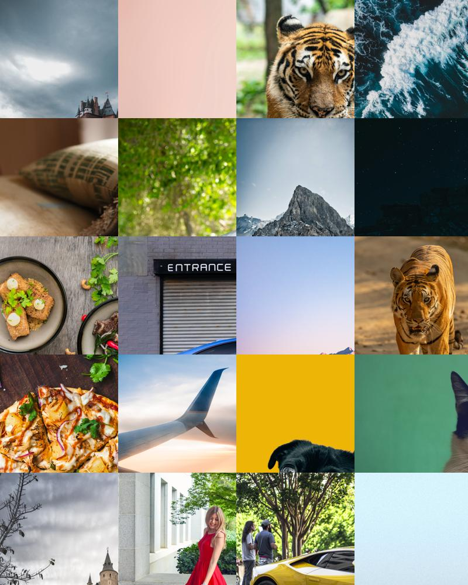
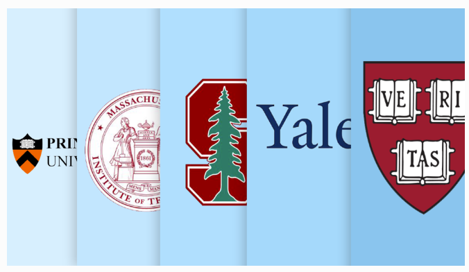

 
 

[Data Analysis](#data-analysis) 

## Projects
**Category**

    
    
        
[Data Analysis](#data-analysis)
    

    
    
    
[Visualization](#visualization)
    

    

    
[Deep Learning](#deeplearning) 
    

    

[Text Analytics](#textanalytics)
    

    

    
[Python](#python)
    

    

    
[Deep Learning](#deeplearning) 
    

 

## Data Analysis
### [1. Gems Price Prediction Using Linear Regression](https://link-to-your-project) 
##### Skills & Tools Used : EDA, Clustering, PCA, Data Mining, Silhouette Score, Segmentation

  

 Conducted a comprehensive Gems Price Prediction project utilizing Linear Regression, a powerful statistical technique. Leveraging a dataset encompassing diverse gem characteristics, I engineered and fine-tuned a Linear Regression model to accurately forecast gem prices based on key attributes. 

### [2. Holiday Package Prediction using Logistic Regression & Linear Discriminative Analysis](https://link-to-your-project) 
##### Skills & Tools Used : EDA, Clustering, PCA, Data Mining, Silhouette Score, Segmentation

  
  
Executed a dynamic project focused on predicting Holiday Package preferences employing advanced statistical techniques, specifically Logistic Regression and Linear Discriminative Analysis. Employing Logistic Regression, I precisely modeled and predicted the likelihood of customers opting for specific holiday packages based on a myriad of factors.

### [3. Market Segmentation using Clustering and PCA](https://link-to-your-project) 
##### Skills & Tools Used : EDA, Clustering, PCA, Data Mining, Silhouette Score, Segmentation

  

 Conducted a comprehensive project in Market Segmentation utilizing advanced techniques such as Exploratory Data Analysis (EDA), clustering, and Principal Component Analysis (PCA). Through EDA, intricate patterns within complex datasets were unveiled, providing profound insights into underlying structures. Applied sophisticated clustering techniques to meticulously segment Digital Marketing Advertisement data, empowering the formulation of highly targeted marketing strategies. 

## Visualization
### [4. Rainbow Floral Drawing Using Turtle Graphics](https://sindujasivan.github.io/TurtleGraphicsFloral/) 
##### Skills & Tools Used : turtle, colorsys

  

 "RainbowFlowerArt" is an engaging Python project utilizing the Turtle graphics library to animate the creation of a vivid and dynamic flower. The program draws a blossoming flower with six petals, each showcasing a vibrant color spectrum reminiscent of a rainbow. Through a seamless blend of geometric patterns and color transitions, the project offers an interactive and visually captivating exploration of artistic expression using programming. 

## Deep Learning
### [5. Image Classification Using InceptionV3](https://sindujasivan.github.io/pretrained-inceptionv3-image-classification/) 
##### Skills & Tools Used : TensorFlow and Keras, pandas, Matplotlib

  

This project involves developing an image classification and recognition system using the InceptionV3 deep learning model. Through transfer learning, the model is fine-tuned on a custom dataset for accurate classification. The user-friendly interface accepts image inputs, displaying detailed tabular results with top predictions and probabilities, accompanied by a visual representation of the classified images. The project aims to deliver an accessible and comprehensive tool for image understanding and classification. 

## Text Analytics 
### [6. Quotable Sentiment Analysis](https://sindujasivan.github.io/Quotable-Sentiment-Analysis/) 
##### Skills & Tools Used : pandas, requests, BeautifulSoup, re, nltk, stopwords, WordCloud, string, matplotlib.pyplot

  

 The project aims to address the challenge of efficiently analyzing and visualizing the sentiments expressed by different authors in the quotes by conducting sentiment analysis on a collection of quotes gathered from a prominent quote website. Through web scraping, we have obtained a dataset containing quotes along with their respective authors. The primary goal is to explore the sentiments conveyed by these authors and visualize the emotional tone of their quotes. 

## Python
### [7. Python College Analytics](https://sindujasivan.github.io/Python-College-Analytics/)
##### Skills & Tools Used : numpy, pandas

  

 Executed a comprehensive Exploratory Data Analysis (EDA) project, employing advanced statistical methods to extract actionable insights from complex datasets.Leveraging a variety of statistical methodologies, the project delved deep into the intricacies of the dataset, extracting meaningful and relevant conclusions. This included measures of central tendency, dispersion, and correlation, among others, to paint a holistic picture of the data landscape. 

